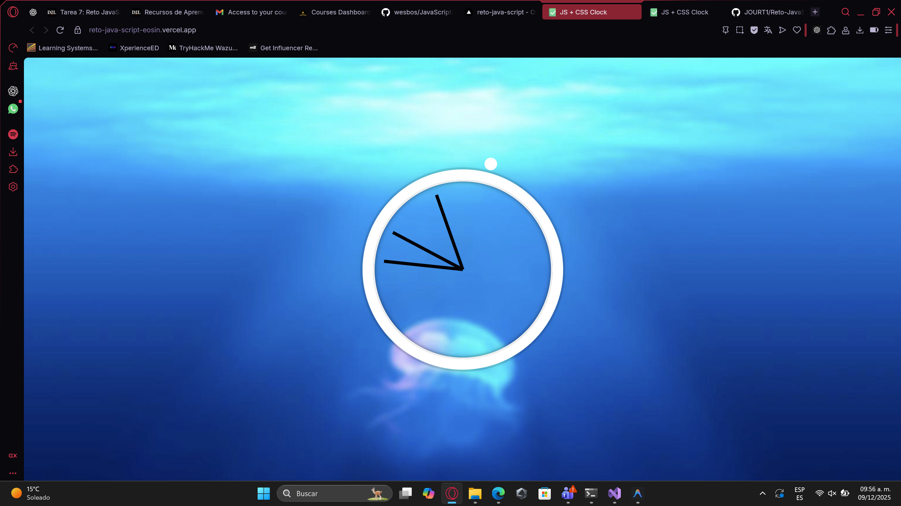

# ⏰ CSS + JS Clock

Un reloj analógico funcional y animado creado con HTML, CSS y JavaScript vanilla. Este proyecto demuestra el uso de transformaciones CSS, manipulación del DOM y la API de fechas de JavaScript para crear un reloj que muestra la hora actual en tiempo real.

## 📋 Descripción del Reto

**Nombre del Reto:** CSS + JS Clock

**Objetivo:** Crear un reloj analógico funcional que muestre la hora actual del sistema, utilizando JavaScript para calcular los ángulos de rotación de las manecillas y CSS para las animaciones y el diseño visual.

## 🛠️ Tecnologías Utilizadas


- **HTML5** - Estructura del reloj
- **CSS3** - Estilos, animaciones y transformaciones
- **JavaScript (Vanilla)** - Lógica del reloj y actualización en tiempo real

## 📸 Captura de Pantalla



## 🚀 Instrucciones de Instalación y Ejecución Local

### Opción 1: Descarga Directa
1. Descarga el archivo `index.html` del repositorio
2. Abre el archivo en tu navegador web favorito
3. ¡El reloj comenzará a funcionar automáticamente!

### Opción 2: Clonar el Repositorio
```bash
# Clonar el repositorio
git clone https://github.com/JOURT1/Reto-JavaScript.git

# Navegar al directorio
cd Reto-JavaScript

# Abrir index.html en tu navegador
# En Windows:
start index.html

# En macOS:
open index.html

# En Linux:
xdg-open index.html
```

**Nota:** No se requiere instalación de dependencias ni servidor local. Es un proyecto 100% estático.

## 🎨 Estructura CSS

### Estilos Principales

#### **Fondo y Layout**
```css
html {
  background: #018DED url(https://unsplash.it/1500/1000?image=881&blur=5);
  background-size: cover;
}
```
- Fondo azul con imagen difuminada de Unsplash
- Diseño centrado usando Flexbox

#### **Reloj**
```css
.clock {
  width: 30rem;
  height: 30rem;
  border: 20px solid white;
  border-radius: 50%;
  box-shadow: múltiples capas de sombras
}
```
- Círculo perfecto de 30rem de diámetro
- Borde blanco de 20px
- Múltiples sombras para efecto 3D

#### **Manecillas**
```css
.hand {
  width: 50%;
  height: 6px;
  background: black;
  transform-origin: 100%;
  transition: all 0.05s cubic-bezier(0.1, 2.7, 0.58, 1);
}
```
- Ancho del 50% del reloj
- Punto de rotación en el extremo derecho (`transform-origin: 100%`)
- Transición suave con efecto de rebote (cubic-bezier)

## 💻 Funcionamiento del JavaScript

### 1. **Selección de Elementos**
```javascript
const secondHand = document.querySelector('.second-hand');
const minsHand = document.querySelector('.min-hand');
const hourHand = document.querySelector('.hour-hand');
```
Selecciona las tres manecillas del DOM usando `querySelector`.

### 2. **Función Principal: `setDate()`**

#### **Obtener la hora actual**
```javascript
const now = new Date();
```
Crea un objeto Date con la hora actual del sistema.

#### **Cálculo de la manecilla de segundos**
```javascript
const seconds = now.getSeconds();
const secondsDegrees = ((seconds / 60) * 360) + 90;
secondHand.style.transform = `rotate(${secondsDegrees}deg)`;
```
- `seconds / 60`: Convierte segundos a fracción (0-1)
- `* 360`: Convierte a grados (0-360)
- `+ 90`: Ajuste inicial porque la manecilla comienza a las 3 en punto (90°)

#### **Cálculo de la manecilla de minutos**
```javascript
const mins = now.getMinutes();
const minsDegrees = ((mins / 60) * 360) + ((seconds/60)*6) + 90;
minsHand.style.transform = `rotate(${minsDegrees}deg)`;
```
- `(mins / 60) * 360`: Grados basados en minutos
- `(seconds/60)*6`: Movimiento suave entre minutos (cada segundo = 0.1°)
- `+ 90`: Ajuste inicial

#### **Cálculo de la manecilla de horas**
```javascript
const hour = now.getHours();
const hourDegrees = ((hour / 12) * 360) + ((mins/60)*30) + 90;
hourHand.style.transform = `rotate(${hourDegrees}deg)`;
```
- `(hour / 12) * 360`: Grados basados en horas (formato 12h)
- `(mins/60)*30`: Movimiento suave entre horas (cada minuto = 0.5°)
- `+ 90`: Ajuste inicial

### 3. **Actualización Continua**
```javascript
setInterval(setDate, 1000);
setDate();
```
- `setInterval(setDate, 1000)`: Ejecuta `setDate()` cada 1000ms (1 segundo)
- `setDate()`: Llamada inicial para evitar esperar 1 segundo al cargar

## 🔧 Conceptos Técnicos Utilizados

### JavaScript
- ✅ **DOM Manipulation**: `querySelector()`, `style.transform`
- ✅ **Date API**: `new Date()`, `getSeconds()`, `getMinutes()`, `getHours()`
- ✅ **Timers**: `setInterval()`
- ✅ **Template Literals**: `` `rotate(${degrees}deg)` ``
- ✅ **Matemáticas**: Conversión de tiempo a grados

### CSS
- ✅ **Flexbox**: Centrado del reloj
- ✅ **Transforms**: `rotate()`, `transform-origin`
- ✅ **Transitions**: Animaciones suaves
- ✅ **Box-shadow**: Efectos de profundidad
- ✅ **Border-radius**: Círculos perfectos
- ✅ **Cubic-bezier**: Curvas de animación personalizadas

## 📊 Fórmulas Matemáticas

### Conversión de Tiempo a Grados

| Manecilla | Fórmula | Explicación |
|-----------|---------|-------------|
| **Segundos** | `(s / 60) × 360 + 90` | 60 segundos = 360°, +90° offset |
| **Minutos** | `(m / 60) × 360 + (s/60)×6 + 90` | 60 minutos = 360°, movimiento suave |
| **Horas** | `(h / 12) × 360 + (m/60)×30 + 90` | 12 horas = 360°, movimiento suave |

### ¿Por qué +90°?
Las manecillas comienzan horizontalmente apuntando a la derecha (posición de las 3 en punto). Para que apunten hacia arriba (12 en punto), necesitamos rotarlas 90° en sentido horario.

## 🎯 Archivos del Proyecto

- **`index.html`**: Versión completa y funcional del reloj
- **`README.md`**: Este archivo de documentación
- **`IMG/ImgFuncEnDeploy.png`**: Captura de pantalla del funcionamiento

## 🌐 Despliegue en Vivo

🚀 **Ver proyecto en funcionamiento:** [https://reto-java-script-eosin.vercel.app](https://reto-java-script-eosin.vercel.app)

El proyecto está desplegado en **Vercel** y se actualiza automáticamente con cada push a la rama `main`.

## 🌟 Mejoras Posibles

- [ ] Agregar marcadores de horas (1-12)
- [ ] Modo oscuro/claro
- [ ] Selector de zonas horarias
- [ ] Sonido de tic-tac
- [ ] Alarmas personalizables
- [ ] Diferentes estilos de reloj

## 📚 Aprendizajes Clave

1. **Manipulación del DOM**: Cómo seleccionar y modificar elementos
2. **API de Fechas**: Trabajar con objetos Date en JavaScript
3. **Transformaciones CSS**: Uso de `rotate()` y `transform-origin`
4. **Intervalos**: Ejecución de código repetitivo con `setInterval()`
5. **Matemáticas aplicadas**: Conversión de unidades de tiempo a grados

## 👨‍💻 Autor

**Jhoel Alexander Suarez Santander**
- GitHub: [@JOURT1](https://github.com/JOURT1)
- Proyecto: CSS + JS Clock

## 📄 Licencia

Este proyecto es de código abierto y está disponible para uso educativo.

---

⭐ Si te gustó este proyecto, ¡dale una estrella en GitHub!

